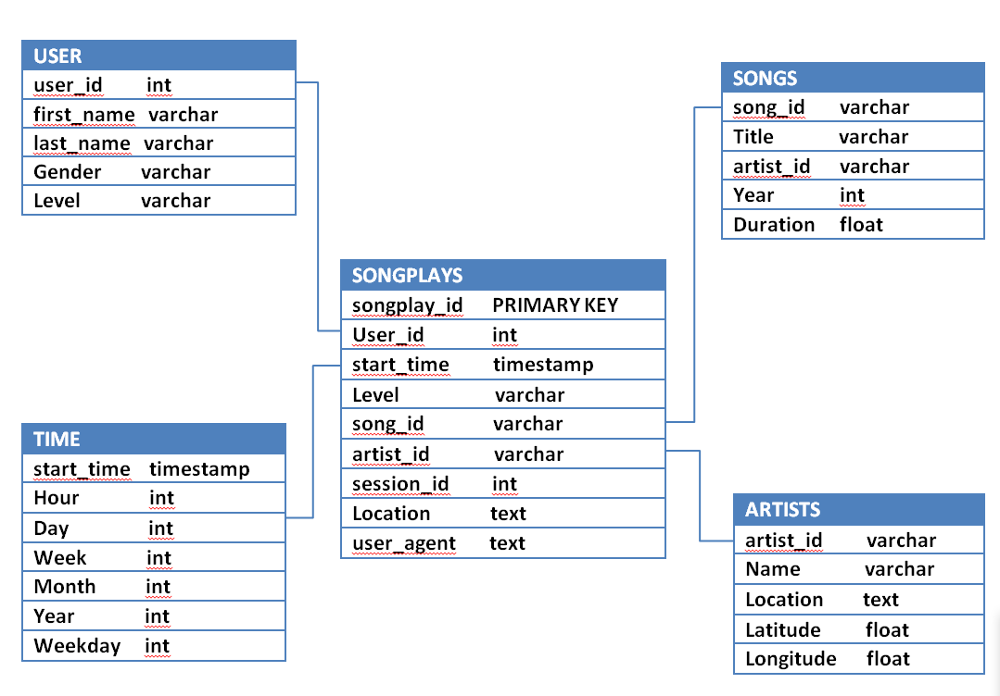

# Project: DATA MODELING WITH POSTGRES

## Introduction

A music based startup company named Sparkify has developed a new music streaming application and wants to analyze the data they have been accumulating on songs and user activity on their app.The analytics team is basically showing their interest in understanding of what songs users are listening to.Currently, they don't have an easy way to access and query their data, which resides in a directory of JSON logs on user activity on the app, as well as a directory with JSON metadata on the songs in their app.

Being an data engineer,my role is to create a database schema,tables,ETL pipelines to model the data , running queries and fetching results as per the analytics team requirement.

## Description

In this project,I have tried to apply what I have learned on data modeling with Postgres database and built an ETL pipeline using Python.

As per the scope of the project, I have defined Fact and Dimension tables for a star schema for a particular analytic focus like the users and the type of songs they listen to and the artists of those songs and written an ETL pipeline that transfers data from files in two local directories into these tables in Postgres database using **Python** and **SQL**.The database provides a consistent and reliable source to store this data. The data from the database would help Sparkify to reach some analytical goals like finding out songs that have highest popularity or times of the day which is high in traffic.

## Objective

- To understand and analyze the data about the songs, the corresponding artists and the users who listen to.
- To create Sparkify database schema,tables using STAR schema data model for storing songs and user activity related information.
- To populate song and user related data in the tables through ETL pipeline.
- To run queries on the tables in order to match the expectation of analytics team.

## Datasets

### Song dataset

The song file is in JSON format and contains metadata about a song and the artist of that song.The files are partitioned by the first three letters of each song's track ID.The files are partitioned by the first three letters of each song's track ID. Below are some examples of filepaths to song files in the song dataset.

For example: 

song_data/A/B/C/TRABCEI128F424C983.json
song_data/A/A/B/TRAABJL12903CDCF1A.json

### Log dataset

The log dataset consist of log files in JSON format generated by the event simulator based on the songs in the dataset above.These log files are partitioned by year and month.Below are some examples of filepaths to log files in the log dataset.

For example:

log_data/2018/11/2018-11-12-events.json
log_data/2018/11/2018-11-13-events.json

## Database Design and ETL pipeline

- For this project,STAR schema model has been used to design the schema in Postgres databse. This design is prefered as it simplifies    queries and provides fast aggregation of data.

- This design includes one fact table and four dimension tables  to store the song and log dataset in an organized manner for songplay analysis.Following are the tables and their description.

- Fact Table:
    - Songplays : Stores log data associated with the songplays i.e. records with page *NextSong*. Attribute includes songplay_id,start_time,user_id,level,song_id,artist_id,session_id,location,user_agent.
    
- Dimension Table:
    - users : stores information about the users in the app. Attribute includes user_id, first_name, last_name, gender, level
    - songs : captures information about songs in music database. Attribute includes song_id, title, artist_id, year, duration
    - artists : records information about artists of corresponding song in music database.Attribute includes artist_id, name, location, latitude, longitude.
    - time : timestamps of records in songplays broken down into specific units. Attribute includes start_time, hour, day, week, month, year, weekday
    
### Below illustrates the data model for schema design.

 

- The column level constraints like PRIMARY KEY,NOT NULL have been applied to deal with the relational database system. For instance, start_time, user_id should be considered as NOT NULL.

- For the design of ETL pipeline, Python is used as it contains libraries such as pandas which simplifies data manipulation,psycopg2 allows connection to postgres database.

## ETL Design

- CREATE DATABASE AND TABLES: Below steps have been followed to create database and tables.
    1. CREATE statementes for each tables have been written in **sql_queries.py
    2. DROP statements for each tables have been written in **sql_queries.py** to drop tables if already exist.
    3. RUN **create_tables.py** to create the database and tables.
    4. Run **test.ipynb** to confirm the creation of database and tables with desired attributes.
    
> It is to be ensured to click **Restart kernel** to close the connection to the database after running the notebook.

- BUILD ETL Pipeline: There is different ETL process for each table.In **etl.py**, there is a function called *process_data*.Filepaths for both songs and log dataset can be passed to the function to process the data.It fetches all files matching extension(.json) from the directory and it iterates over the files and processes using the functions passed into it.

- PROCESS SONG DATA: Song datasets have been used to populate songs and artists dimensional tables. **process_song_file** function is used to perform following tasks.
    - get list of all song JSON files in "data/song_data" directory.
    - Read the song files
    - Extract data for **songs** table and insert data into it. 
        - from dataset song_id,title,artist_id,year and duration columns have been extracted.
        - Python command df.values has been used to select just the values from the dataframe. 
        - It has been indexed to select the first(only) record in the dataframe.
        - The array has been converted to a list using list() function and set it to song_data
        - song_table_insert query has been written in sql_queries.py to insert record into songs table.
    
    - Extract data for **artists** table and insert data into it. Data extraction for this similar to song table.
        - from dataset artist_id, name, location, latitude, longitude columns have been extracted.
        - Python command df.values has been used to select just the values from the dataframe. 
        - It has been indexed to select the first(only) record in the dataframe.
        - The array has been converted to a list using list() function and set it to song_data
        - artist_table_insert query has been written in sql_queries.py to insert record into songs table.
        
- PROCESS LOG DATA: log datasets have been used to populate users,time dimensional tables and songplays fact table. **process_log_file** function is used to perform following tasks.
    - get list of all song JSON files in "data/log_data" directory.
    - Read the log files.
    - Extract data for **time** table and insert data into it.
        - Filtered the data by "NextSong" action.
        - Converted the ts timestamp column to datetime using pandas to_datetime.
        - The other attributes such as hour, day, week, month, year, weekday have been extracted from ts timestamp clomun using pandas *dt.* function.
        - time_table_insert query has been written in sql_queries.py to insert into time table.
    
    - Extract data for **users** table and insert data into it.
        - From log dataframe user_id, first_name, last_name, gender, level columns have been extracted.
        - user_table_insert query has been written in sql_queries.py to insert record into users table.
        
    - Extract data for **songplays** table and insert data into it.Since the log file does not specify an ID for either the song or the artist, the song ID and artist ID can be got by querying the songs and artists tables to find matches based on song title, artist name
        - Get song_id and artist_id from song_table and artist table using song_select query in sql_queries.py.
        - From log dataset timestamp, user ID, level, song ID, artist ID, session ID, location, and user agent have been extracted.
        - songplay_table_insert query has been written in sql_queries.py to insert record into songplays table.
        
## Run ETL pipeline

In summary, below two steps need to be done to perform ETL.
1. RUN create_tables.py to create the databse and tables.
2. RUN etl.py to populate data in the created tables.

# Conclusion 

Postgres databse with tables have been designed to optimize queries on songplay analysis.The analytics team has got an easy access to query their data and analyze understanding what songs users are listening to.

    
  

